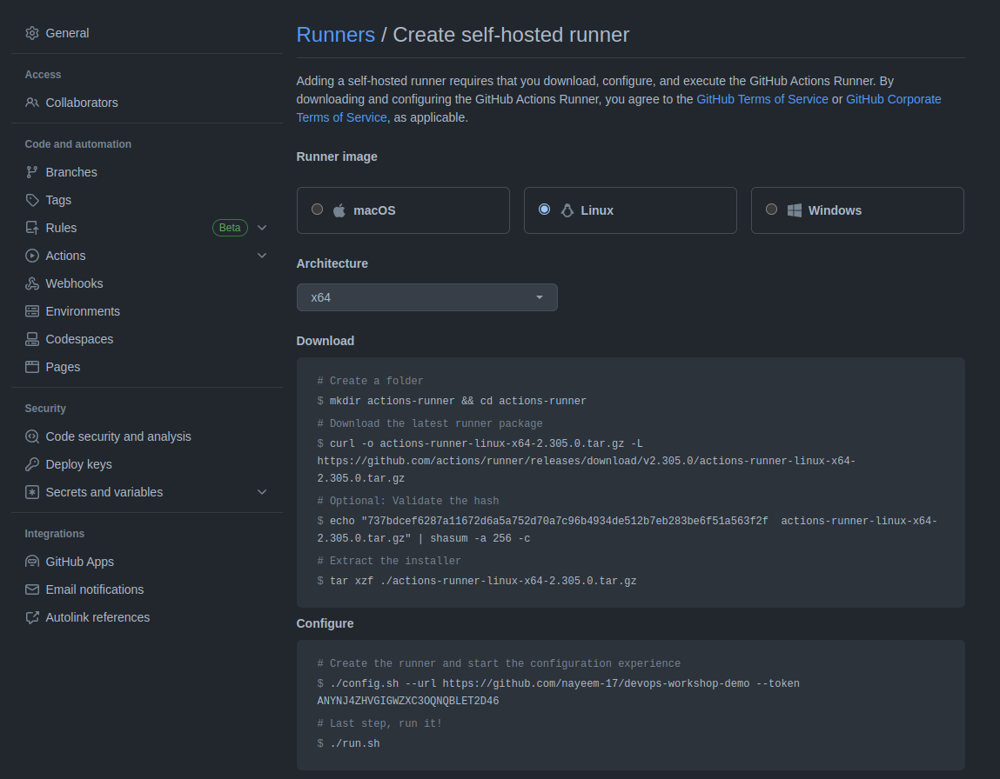

## Buet Cse fest 2023
## DevOps Hackathon

There's a demo node application in the `index.js` file. There are two routes.
```
\hello
\bye
```

Now we are gonna make a complete ci/cd pipeline for this application & deploy it in a server. We've some test cases for this application. We'll run those test cases in our ci/cd pipeline. If all the test cases pass, then we'll deploy the application on the server. We'll use GitHub actions for the ci/cd pipeline. We'll use aws ec2 instance as our server.  

  ### Continuous Integration
  For the ci part, we'll write a GitHub actions workflow named `ci.yml`

  ```
    name: Test

    on:
      pull_request:
        branches:
          - master

    jobs:
      test:
        runs-on: ubuntu-latest

        steps:
          - name: Checkout code
            uses: actions/checkout@v2

          - name: Set up Node.js
            uses: actions/setup-node@v2
            with:
              node-version: "14"

          - name: Install dependencies
            run: npm ci

          - name: Run tests
            run: npm run test

  ```
This workflow will be triggered when we create a pull request to the master branch. It'll run the test cases & if all the test cases pass, then it'll merge the pull request to the master branch.  

  ### Continuous Deployment
  For the cd part, we'll write a GitHub actions workflow named `deploy.yml`
```
name: Deploy

on:
  push:
    branches:
      - master

jobs:
  deploy:
    runs-on: self-hosted

    steps:
      - name: Checkout code
        uses: actions/checkout@v2

      - name: Install dependencies
        run: sudo apt install docker-compose -y

      - name: Deploy to VM
        run: |
          sudo docker-compose down -v && sudo docker-compose up -d --build

```
This workflow will be triggered when we push to the master branch. It'll deploy the application on the server. We have used `docker-compose` to deploy the application. GitHub will automatically deploy the application in the server when we push it to the master branch. We can configure our server to pull the code from Git Hub & deploy the application automatically by adding our server as a GitHub runner.

### Demo
  We've deployed the application on the server. You can visit the application using this link:

http://54.170.217.14/hello
---

---
## How to run the application on your server
  ### Steps
  - Fork this repository.
  - Go to your repository settings.
  - Add your server as a GitHub runner (see below).
## How to add our server as a GitHub runner
To add our server as a GitHub runner, we need to follow these steps: We can see this when we go to our GitHub repository-> settings-> runner-> self-hosted runner 

Just follow the instructions and we'll be able to add our server as a GitHub runner.

  - Now follow the instructions above to create the ci/cd pipeline.


<!-- nohup ./run.sh > /dev/null 2>&1 & -->